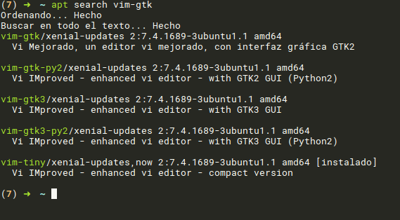
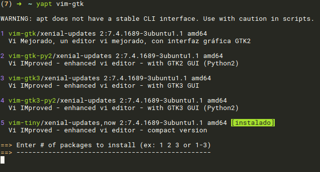

# yapt [Yaourt APT]

yapt implements an installation menu interface around `apt search` command like `yaourt` does in Arch Linux.

**Normal apt command**



**yapt command**



## Usage

```
usage: yapt [-h] [-y] [-d] [-n] pkg

positional arguments:
  pkg              the package to search.

optional arguments:
  -h, --help       show this help message and exit
  -y, --noconfirm  don't ask for confirmation.
  -d, --debug      debug mode (don't execute command).
  -n, --nocolor    no colored output.

```

## Dependencies

+ python3

## Instalation

`pip3 install yapt`

## Customize colors

yapt can read a configuration file (`~/.yaptrc` or `~/.config/yapt/yaptrc`). Example of a configuration file:

```
# AVAILABLE COLORS:
# black, red, green, yellow, blue, magenta, cyan, white, none

[Colors]
pkgfore = green
pkgback = none
numfore = magenta
numback = none
insfore = black
insback = green
arrfore = yellow
arrback = none
```
